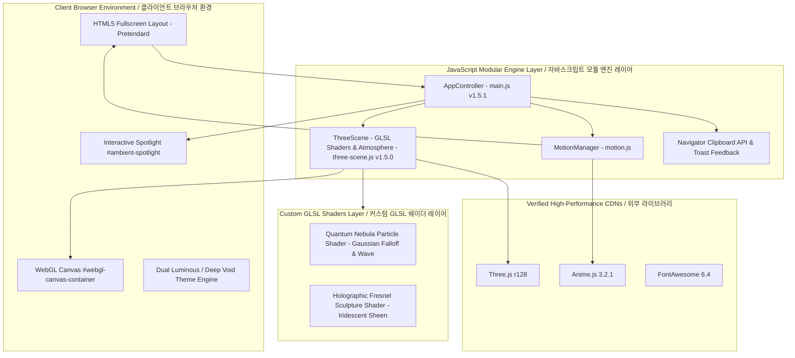

# Studio Chorok Architecture & System Structure / 시스템 구조 및 아키텍처 명세서

> **Language Notice / 언어 안내**: This document is provided in both English and Korean. / 본 문서는 영문과 한글을 동시에 병기하여 제공됩니다.  
> **Current Version / 현재 버전**: `1.5.1` (Interactive Ambient Spotlight & Custom GLSL Edition)

---

## 1. Directory Structure / 디렉터리 구조

```text
Studio-Chorok.github.io/
├── index.html                  # Fullscreen Semantic Layout with Ambient Spotlight / 풀스크린 시맨틱 레이아웃 및 스포트라이트 오버레이
├── css/
│   └── style.css               # Dual Atmosphere Tokens & Ambient Spotlight Styles / 듀얼 테마 토큰 및 앰비언트 스포트라이트 스타일
├── js/
│   ├── three-scene.js          # Custom GLSL Shaders & Metallic Torus Atmosphere / 커스텀 GLSL 쉐이더 및 메탈릭 토러스 3D 엔진
│   ├── motion.js               # Restrained Stagger Transitions / 절제된 시네마틱 스태거 모션
│   └── main.js                 # App Controller & Spotlight Lerp Coordinator / 스크롤 기반 테마 전환 및 스포트라이트 코디네이터
├── img/
│   └── CI.png                  # Studio Chorok Corporate Identity Logo / 스튜디오 초록 공식 CI 로고
├── app-ads.txt                 # Ad Verification File / 광고주 인증 텍스트
├── googleb8b41052f9145a46.html # Google Search Console Verification / 구글 서치 콘솔 소유권 확인 파일
├── STRUCTURE.md                # System Architecture Documentation / 시스템 아키텍처 및 구조 문서
├── API.md                      # Module Interface & Event Specification / 모듈 인터페이스 및 이벤트 규격서
├── WIKI.md                     # Function Reference & Technical Wiki / 함수 상세 레퍼런스 및 테크니컬 위키
├── README.md                   # Project Overview, Usage & Pros/Cons / 프로젝트 개요, 사용방법 및 장단점
├── CHANGELOG.md                # SemVer Version History & Changelog / 시맨틱 버저닝 기반 변경 이력서
└── GUIDE.md                    # User Customization & Deployment Guide / 사용자 설정 및 배포 가이드
```

---

## 2. High-Level Architecture Diagram / 고수준 아키텍처 다이어그램



---

## 3. Layered Design Breakdown / 레이어별 상세 설계

### English
1. **Presentation & View Layer (`index.html`, `css/style.css`)**:
   - Clean fullscreen composition presenting authentic editorial sections without clutter.
   - Standardized on **Pretendard** typography, strictly omitting italic styles.
   - Pure Cyan uppercase category tags for maximum clarity.
   - Added `#ambient-spotlight`: A fluid, real-time radial gradient spotlight tracking cursor movements smoothly across viewport coordinates.
2. **Multi-Chromatic 3D WebGL Atmosphere Layer (`js/three-scene.js v1.5.0`)**:
   - 3,200 Quantum Nebula particles powered by custom GLSL shaders with harmonic waves and Gaussian falloff.
   - Metallic Torus Knot centerpiece sculpture utilizing custom Fresnel iridescent holographic reflections.
   - Dual rim lighting setup (Electric Cyan & Champagne Gold point lights) providing depth.
3. **Motion & Interaction Layer (`js/motion.js`)**:
   - Calibrated, restrained stagger transitions fading into view smoothly.
4. **App Coordination Layer (`js/main.js v1.5.1`)**:
   - Lightweight coordinator managing scroll progress, dynamic gallery-to-deep-void theme transitions, smooth mouse Lerp spotlight positioning, and one-click email copying.

### 한국어
1. **프레젠테이션 & 뷰 레이어 (`index.html`, `css/style.css`)**:
   - 불필요한 장식 박스를 배제하고 본문 텍스트에 온전히 집중한 풀스크린 레이아웃.
   - 타이포그래피를 **Pretendard** 단일 산세리프 체계로 통일하고 이탤릭체를 완전히 배제.
   - 순수 시안 대문자 카테고리 태그로 군더더기 없는 가독성 확보.
   - `#ambient-spotlight` 탑재: 마우스 포인터의 위치를 부드럽게 추적하며 화면 전반에 은은한 빛을 투사하는 래디얼 조명 레이어.
2. **멀티 크로매틱 3D WebGL 배경 레이어 (`js/three-scene.js v1.5.0`)**:
   - 3,200개의 양자 성운 파티클: 3D 조화 파동과 가우시안 소프트 감쇠를 머금은 커스텀 GLSL 쉐이더.
   - 메탈릭 코스믹 토러스 조각상: 시선 각도에 따라 일렉트릭 시안과 골드가 영롱하게 굴절되는 프레넬 홀로그래픽 쉐이더.
   - 듀얼 림라이트(시안 & 골드) 및 내부 크리스탈 코어로 극적인 입체감 형성.
3. **모션 & 인터랙션 레이어 (`js/motion.js`)**:
   - 절제되고 세련된 스태거 페이드 인 트랜지션 제공.
4. **앱 코디네이션 레이어 (`js/main.js v1.5.1`)**:
   - 스크롤 진행률, 밝은 갤러리/딥 보이드 테마 전환, 마우스 스포트라이트 럴프(Lerp) 보간 및 원클릭 메일 복사 총괄.
