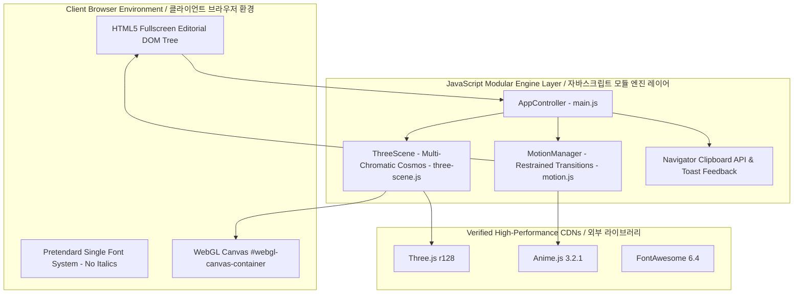

# Studio Chorok Architecture & System Structure / 시스템 구조 및 아키텍처 명세서

> **Language Notice / 언어 안내**: This document is provided in both English and Korean. / 본 문서는 영문과 한글을 동시에 병기하여 제공됩니다.
> **Current Version / 현재 버전**: `1.4.0` (Pretendard Typography & Pure Minimalist Tag Edition)

---

## 1. Directory Structure / 디렉터리 구조

```text
Studio-Chorok.github.io/
├── index.html                  # Fullscreen Editorial Document & Semantic Layout / 풀스크린 에디토리얼 시맨틱 웹 문서
├── css/
│   └── style.css               # Pretendard Typography, Color Tokens & Layout / 프리텐다드 서체, 컬러 토큰 및 레이아웃
├── js/
│   ├── three-scene.js          # Multi-Chromatic Cosmic Aurora & Sculptural Engine / 멀티 크로매틱 코스믹 오로라 & 3D 조각품 엔진
│   ├── motion.js               # Restrained Stagger Transitions / 절제된 시네마틱 스태거 모션
│   └── main.js                 # App Coordinator, Scroll Tracker & Direct Mail Copy / 메인 앱 코디네이터, 스크롤 추적 및 메일 복사
├── img/
│   └── CI.png                  # Studio Chorok Corporate Identity Logo / 스튜디오 초록 공식 CI 로고
├── app-ads.txt                 # Ad Verification File / 광고주 인증 텍스트
├── googleb8b41052f9145a46.html # Google Search Console Verification / 구글 서치 콘솔 소유권 확인 파일
├── STRUCTURE.md                # System Architecture Documentation / 시스템 아키텍처 및 구조 문서
├── API.md                      # Module Interface & Event Specification / 모듈 인터페이스 및 이벤트 규격서
├── WIKI.md                     # Function Reference & Technical Wiki / 함수 상세 레퍼런스 및 테크니컬 위키
├── README.md                   # Project Overview, Usage & Pros/Cons / 프로젝트 개요, 사용방법 및 장단점
├── CHANGELOG.md                # SemVer Version History & Changelog / 시맨틱 버저닝 기반 변경 이력서
└── GUIDE.md                    # User Customization & Deployment Guide / 사용자 설정 및 GitHub Pages 배포 가이드
```

---

## 2. High-Level Architecture Diagram / 고수준 아키텍처 다이어그램



---

## 3. Layered Design Breakdown / 레이어별 상세 설계

### English
1. **Presentation & View Layer (`index.html`, `css/style.css`)**:
   - Clean fullscreen composition presenting the authentic 5 sections without promotional quotes or frames.
   - Standardized on **Pretendard** as the single unified sans-serif font system, completely omitting italics.
   - Refined category tags (`Overview`, `UI / UX Innovation`, `Printing & Digital Content`, etc.) rendered as pure uppercase Cyan text with zero oval/dot ornamentation.
   - English-only interface focused purely on core business communication.
2. **Multi-Chromatic 3D WebGL Background Layer (`js/three-scene.js v1.3.0`)**:
   - High-contrast multi-chromatic palette blending signature Emerald with Electric Cyan, Luminous Amber/Gold, and Cosmic Violet.
   - Dual rim lighting setup: dynamic Cyan and Gold point lights illuminating a metallic Torus Knot sculpture and pulsating inner gem core.
   - 2,800 particles swirling gracefully in a cylindrical space with subtle camera depth parallax.
3. **Motion & Interaction Layer (`js/motion.js v1.2.0`)**:
   - Calibrated, restrained stagger transitions fading into view without dizzying velocity.
   - Right-side minimal vertical progress tracker with semantic label tooltips.
4. **App Coordination Layer (`js/main.js v1.2.1`)**:
   - Lightweight coordinator managing scroll progress and one-click email copying (`studio.chorok@gmail.com`) with instant toast popup.

### 한국어
1. **프레젠테이션 & 뷰 레이어 (`index.html`, `css/style.css`)**:
   - 부가적인 인용구 박스를 일체 배제하고 원본 5개 섹션의 본문 텍스트에 온전히 집중한 풀스크린 레이아웃.
   - 전체 타이포그래피를 **Pretendard** 단일 산세리프 체계로 통일하고 이탤릭체를 완전히 배제하여 단단하고 명료한 가독성 확보.
   - 카테고리 태그 앞의 초록색 점 및 타원형 배경을 없애고 세련된 시안 텍스트 형태로만 간결하게 표시.
   - 글로벌 비즈니스에 최적화된 영문 전용(English-Only) 인터페이스.
2. **멀티 크로매틱 3D WebGL 배경 레이어 (`js/three-scene.js v1.3.0`)**:
   - 단조로운 단색 초록을 탈피하여, 시그니처 에메랄드에 일렉트릭 시안(Electric Cyan), 럭셔리 앰버/골드(Luminous Gold), 코스믹 바이올렛을 결합한 다채로운 임팩트 컬러 팔레트 구축.
   - 시안과 골드의 듀얼 림 라이팅(Dual Rim Lighting)으로 금속성 토러스 조각품과 내부 보석 코어의 입체감 극대화.
   - 2,800개의 멀티 컬러 오로라 입자가 고요하게 유영하며 안정적인 시각적 깊이감 형성.
3. **모션 & 인터랙션 레이어 (`js/motion.js v1.2.0`)**:
   - 잉크가 스며들듯 부드럽게 나타나는 절제된 시네마틱 스태거 트랜지션.
   - 우측 미니멀 수직 인디케이터 연동.
4. **앱 코디네이션 레이어 (`js/main.js v1.2.1`)**:
   - 가볍고 정교한 스크롤 진행도 계산 및 `studio.chorok@gmail.com` 원클릭 주소 복사 토스트 인터랙션.
